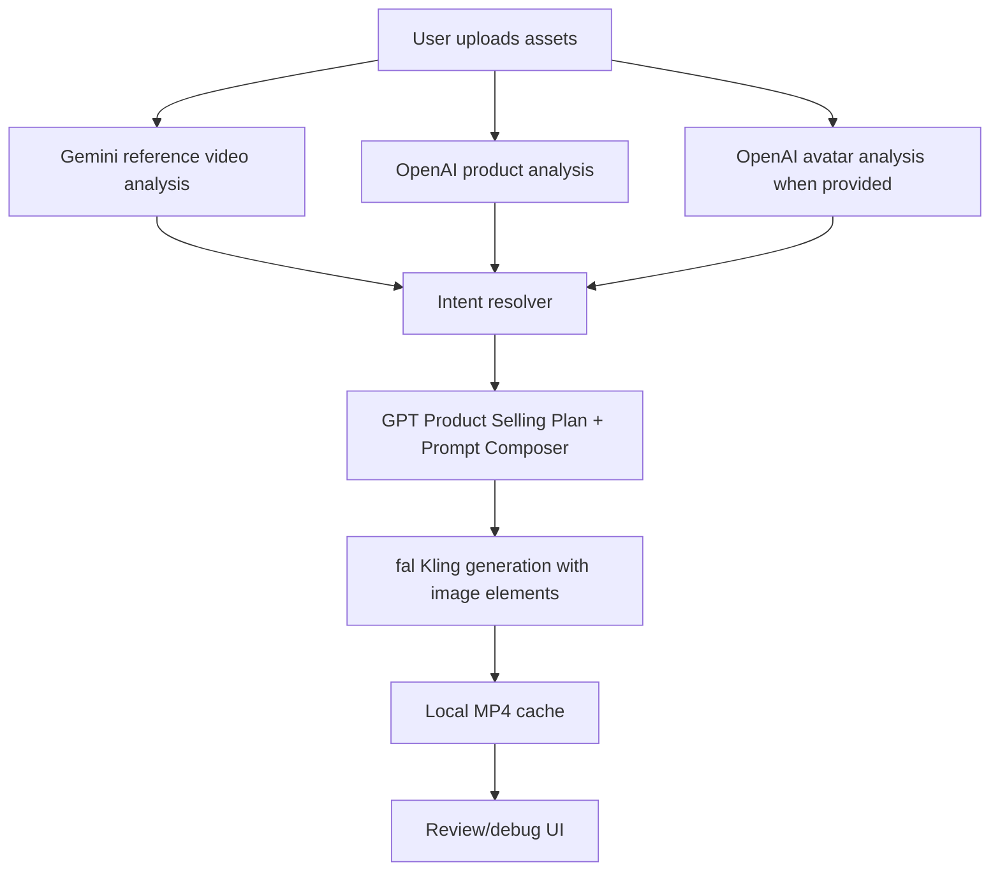

# MVP Product Focus Spec

## User Flow

1. Choose Product Source Mode:
   - Same product
   - Replace product
2. Choose video format.
3. Upload reference video.
4. Upload product image.
5. Choose Creator / Model mode:
   - Auto creator
   - One model for all videos
   - Model per account
6. Select length and variant count.
7. Generate.

## Backend Flow

## Prompt Output

Each prompt must include:

- Asset Lock
- Wardrobe and Hair
- Background
- Motion Shot Plan
- Native Voice

## Asset Rules

With model image:

- Product is `@Element2`
- Model is `@Element1`

Without model image:

- Product is `@Element1`
- Creator is prompt-generated and may vary.

## Product Mode Rules

Same product:

- Preserve reference product handling and demo behavior when consistent with uploaded product image.
- Uploaded product image wins visually.

Replace product:

- Preserve reference structure, framing, gesture pattern, tempo, and proof style.
- Replace source product details with uploaded product analysis.

## Debug UI

Show:

- Reference analysis
- Intent / asset binding
- Asset profiles / product analysis
- Final generation prompt
- Provider errors
